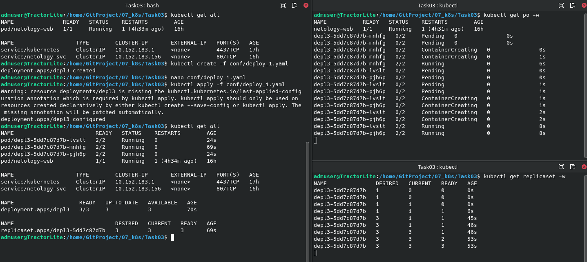
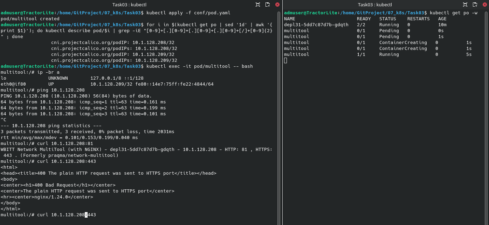
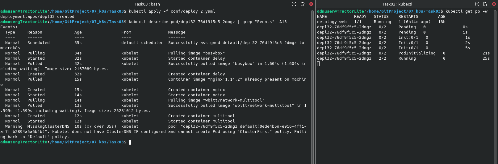

## 
ОТЧЕТ
 
по домашним заданиям к занятию «Запуск приложений в K8S»

## 
Выполнил: студент Порсев И.С.

### Цель задания

В тестовой среде для работы с Kubernetes, установленной в предыдущем ДЗ, необходимо развернуть Deployment с приложением, состоящим из нескольких контейнеров, и масштабировать его.

### Инструменты и дополнительные материалы, которые пригодятся для выполнения задания

1. [Описание](https://kubernetes.io/docs/concepts/workloads/controllers/deployment/) Deployment и примеры манифестов.
2. [Описание](https://kubernetes.io/docs/concepts/workloads/pods/init-containers/) Init-контейнеров.
3. [Описание](https://github.com/wbitt/Network-MultiTool) Multitool.

------

### Задание 1. Создать Deployment и обеспечить доступ к репликам приложения из другого Pod

1. Создать Deployment приложения, состоящего из двух контейнеров — nginx и multitool. Решить возникшую ошибку.
2. После запуска увеличить количество реплик работающего приложения до 2.
3. Продемонстрировать количество подов до и после масштабирования.
4. Создать Service, который обеспечит доступ до реплик приложений из п.1.
5. Создать отдельный Pod с приложением multitool и убедиться с помощью `curl`, что из пода есть доступ до приложений из п.1.

## Решение
> по пунктам 1-3
    
> по пункту 4
 
> по пункту 5
 

Сделал с помощью IP-адресом, потому-что не понял каким-образом возникнет сеть если у всех образов маска сети 32. 
В просторах интернета есть примеры с символьными адресам, но как это реализуется информации не нашел. 
Просидев ~6 часов над п.5 прошу дать подсказку или показать как это выполнить, например через [asciinema](https://asciinema.org/).

## Ссылки на файлы:
>[Deploy](./conf/deploy_1.yaml);    
>[Service](./conf/service_1.yaml);   
>[Pod](./conf/pod.yaml).   

### Задание 2. Создать Deployment и обеспечить старт основного контейнера при выполнении условий

1. Создать Deployment приложения nginx и обеспечить старт контейнера только после того, как будет запущен сервис этого приложения.
2. Убедиться, что nginx не стартует. В качестве Init-контейнера взять busybox.
3. Создать и запустить Service. Убедиться, что Init запустился.
4. Продемонстрировать состояние пода до и после запуска сервиса.

## Решение

    

## Ссылки на файлы:
>[Deploy](./conf/deploy_2.yaml);     

